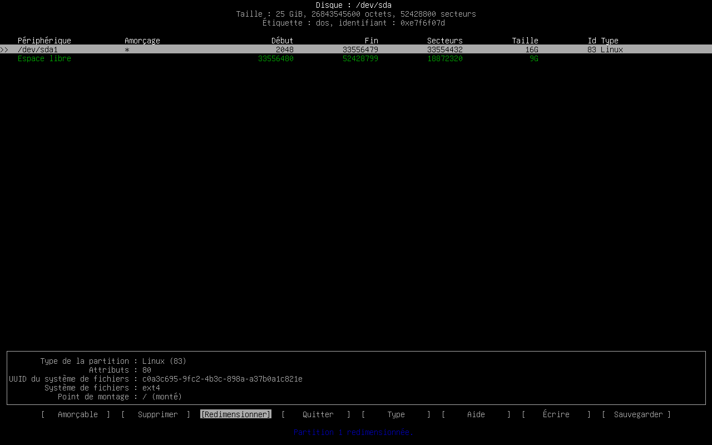
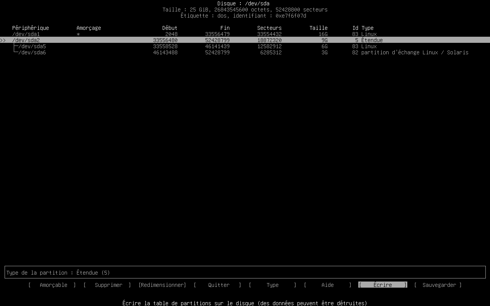

# Exercice 1 - Gestion du stockage

Connexion sous root sur la VM Debian.

On lance le programme **cfdisk**.

On a le tableau des partitions présentes, plus les commandes de menu en bas.

### Libérer de la place et redimensionner

- On supprime la partition /dev/sda2.
- On redimensionne la partition d'amorçage /dev/sda1. On la réduit à 16G.



### Créer les deux nouvelles partitions

- On crée une partition **étendue** /dev/sda2
- Dans /dev/sda2, on crée une nouvelle partition /dev/sda5 de 6G et de type Linux (83)
- On crée une partition /dev/sda6 de type swap (82) avec la place restante, soit 3G



### Vérification et validation

- On vérifie une dernière fois la liste des partitions et on valide avec la commande Ecrire.

### Formatage de la partition Data /dev/sda5

sur le prompt, avec la commande
```bash
mkfs.ext4 /dev/sda5
```

### Montage de la partition Data

On crée un point de montage avec mkdir dans /mnt avant de lancer la commande mount
```bash
mkdir /mnt/data
mount /dev/sda5  /mnt/data
```

### Montage automatique au démarrage

(L'exercice a été interrompu par le plantage de la machine virtuelle. Cette réponse a été rédigée le lendemain.)

* Lancer le programme blkid
* Repérer la ligne avec /dev/sdbx. Noter l'UUID de la partition et ses paramètres.
* Ouvrir : sudo nano /etc/fstab
* Rajouter la ligne :
`  /dev/disk/by-uuid/<UUID>  /mnt/data/  ext4  auto <PARAMETRES>  0  1`
* Sauvegarder et quitter


